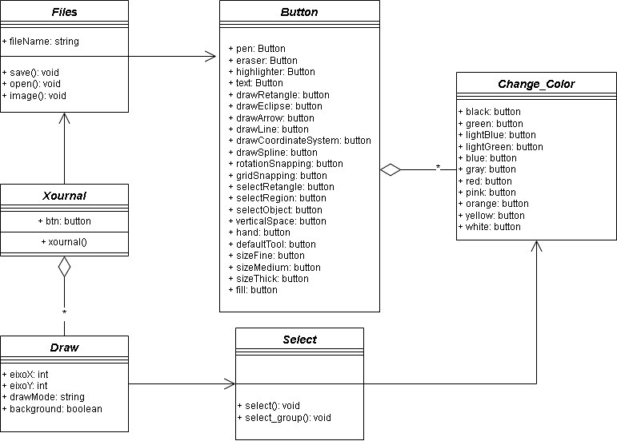
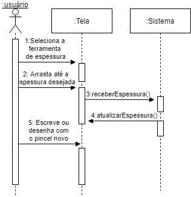
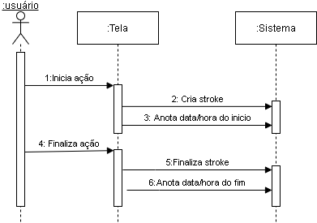
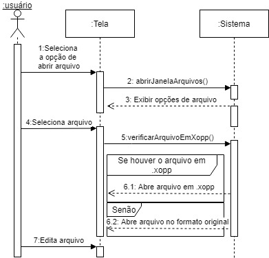

## Architectural Sketch (Esboço de arquitetura)

### Class Diagram (Diagrama de sequência)

### Sequence Diagram (Diagrama de sequência)

1. Regular o espessura do pincel.

2. Inserir data/hora de inicio e fim de cada stroke.
   

3. Abrir documento xopp em vez de pdf.
   

